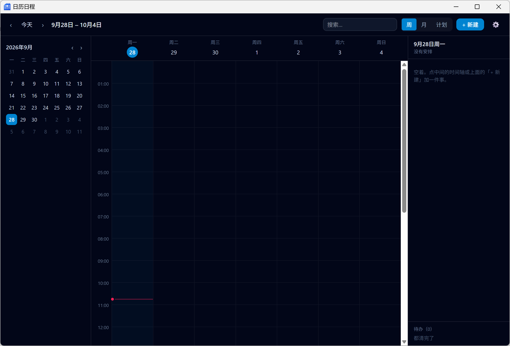

[English](./README.md) | [简体中文](./README.zh-CN.md)

# 日历日程

一款 Windows 桌面日历。**纯离线**——不联网、无账号、无服务器，所有数据就是本机的一个 JSON 文件。

常驻托盘。右下角一块可拖动的悬浮块，随时瞥一眼今天的安排；鼠标悬停即展开面板，显示今日 / 明日 / 长期计划。

---

## 界面

**主窗口** —— 周视图，左侧迷你月历，右侧当日面板。



**悬浮块与悬停面板** —— 悬浮块常驻屏幕右下角，一眼看到今天；鼠标悬停即在其左侧展开面板，两者底边对齐。

<p>
  
  
</p>

---

## 特点

| | |
|---|---|
| **纯离线** | 不发起任何网络请求，没有账号也没有同步服务，数据不出本机 |
| **悬浮块** | 屏幕右下角常驻，可拖动，临近提醒时变红；悬停展开面板，移开自动收起 |
| **长期计划** | 「到某天为止」的事（考研、搬家）独立成页，**不占用日历的时间格** |
| **手动同步** | 存档是标准 JSON，靠导入导出在设备间搬运；冲突按固定规则裁决 |
| **数据可恢复** | 每次写入先备份再落盘，保留最近 10 份快照 + 每日一份 30 天，设置里可回滚 |

---

## 功能

### 主窗口

- **周视图** —— 事件块可拖拽改时间
- **月视图** + 迷你月历导航
- **重复日程** —— 支持 RRULE 子集，按需展开而非预生成实例
- **提醒** —— 定时扫描，发系统通知
- **标签筛选**与搜索

### 悬浮块与小面板

两个独立窗口。悬浮块始终可见，可拖到任意位置；悬停时展开面板列出今日任务、明日任务与长期计划，鼠标移开即收起。

### 长期计划

独立于日历的「计划」页：设定目标日期与自定义提醒日期。由于在数据结构上与事件并列，计划**在结构上就不可能出现在周视图或月视图里**，不需要在渲染层做过滤。

### 设置

每周起始日、默认提醒时间、开机自启、导入 / 导出存档、历史版本恢复。

---

## 快速开始

### 只跑前端（浏览器预览，无需 Rust）

```bash
npm install
npm run dev          # http://localhost:1420/
```

检测不到 Tauri 环境时会自动切到 mock 后端：数据是假的、存在 localStorage，文件操作不可用。调界面用这个，改样式不用等 cargo 编译。

### 跑完整应用

需要 Rust 工具链和 MSVC 生成工具：

```powershell
winget install Rustlang.Rustup
winget install Microsoft.VisualStudio.2022.BuildTools   # 勾选「使用 C++ 的桌面开发」
```

装完**重开终端**确认：

```bash
cargo --version && rustc --version
```

然后：

```bash
npm run app          # tauri dev，开发模式
npm run app:build    # tauri build，产出 NSIS 安装包
```

> **只想拿 exe、不想打安装包时**，用 `./node_modules/.bin/tauri build --no-bundle`。
> **不要**图省事直接 `cargo build --release`——它编出来的 exe 能启动，但窗口里显示的是
> 「无法访问此页面」。原因是 `tauri` 的 `custom-protocol` feature 只有 tauri CLI 会在构建时补上，
> 没有它，前端资源会被解析到 devUrl 而不是内嵌资源。

---

## 数据

### 存放位置

`app_data_dir`（Windows 上即 `%APPDATA%\com.opencalendar.calendar\`）：

```
data/calendar.json          主存档
data/calendar.json.bak      上一版（写坏时的最后一道保险）
backups/calendar-*.json     每次写入的快照，保留最近 10 份
backups/daily-*.json        每日一份，保留 30 天
config.json                 应用设置
logs/app.log                日志
```

写入永远是**原子**的：备份 → 写临时文件 → fsync → 重命名覆盖。顺序不能换，这样即使断电，`calendar.json` 要么是旧的完整内容、要么是新的完整内容，不会读到半个 JSON。

软删除的记录保留 90 天后在写入时物理清除。

### 同步

存档是自包含的 JSON，用「导出存档…」拷到另一台机器，「导入存档…」合并进来。同一个 `id` 两端都有时按此裁决：

1. `updatedAt` 新的赢——**不看删没删**。删了之后又在另一端改过，意味着还要这条，事件复活。
2. `updatedAt` 平手时**删除方赢**。复活一条已删记录比少一条记录更难被发现。
3. 平手且都没删时**保留本地**。

`settings` 不参与合并——主题、每周起始日、开机自启是本机偏好，不该被另一端覆盖；覆盖导入同样保留本机 `settings`。

---

## 技术栈

| 层 | 选型 |
|---|---|
| 壳 | Tauri 2 |
| 前端 | React 19 + TypeScript |
| 样式 | Tailwind 4（CSS-first，无 config 文件） |
| 后端 | Rust |
| 存储 | 本地 JSON 文件 |

时间为**固定 UTC+8**，不读系统时区。中国不实行夏令时，本地时间不会重复或缺失，因此事件时间存不带偏移的本地时间串，时间戳存带偏移的。

---

## 项目结构

```
.
├── index.html / panel.html / float.html   三个窗口各自的入口
├── src/
│   ├── types.ts               存档结构的 TS 镜像（对应 model.rs，两边必须同步改）
│   ├── float-window.tsx       悬浮块
│   ├── panel-window.tsx       小面板
│   ├── main-window.tsx        主窗口
│   ├── components/            WeekView / MonthView / MiniMonth / EventEditor
│   │                          / PlansView / PlanEditor / SettingsDialog
│   └── lib/
│       ├── time.ts            时间解析与格式化（固定 UTC+8）
│       ├── ipc.ts             前后端唯一通道 + 浏览器降级
│       ├── mock.ts            浏览器预览用的假后端
│       └── useArchive.ts      共用的数据钩子
├── scripts/                   验证界面用的工具，不参与打包
│   ├── make-icon.mjs          生成应用图标源图
│   ├── dump-windows.ps1       列出某进程的可见窗口
│   ├── probe-window.ps1       客户区尺寸 + 屏幕原点 + DPI
│   ├── shot-window.ps1        截取某进程最大的可见窗口
│   └── click-at.ps1           在屏幕坐标处点一下
└── src-tauri/
    ├── tauri.conf.json        打包与权限配置
    ├── capabilities/          Tauri v2 权限
    └── src/
        ├── model.rs           数据结构
        ├── storage.rs         存档读写与备份
        ├── recurrence.rs      RRULE 展开
        ├── import_export.rs   导入导出与合并
        ├── commands.rs        IPC 命令
        ├── window.rs          三窗口管理
        ├── tray.rs            托盘
        └── reminder.rs        提醒调度
```

> 三个窗口由 `window.rs` 创建，`tauri.conf.json` 的 `windows` 是空数组。

---

## 已知限制

- **仅支持 Windows**。托盘、注册表开机自启、NSIS 打包都是 Windows 专属。
- **Android 端尚未开始**。数据结构与存档格式已按双端设计，但目前只有 PC 端。
- **只有深色主题**。界面上约上百处颜色是写死的 Tailwind 类，做浅色需要先把它们收进一套 design token。
- **月视图不支持拖拽**；重复日程的拖动被显式拦下（需要先回答「改单次还是改系列」）。
- **搜索只过滤当前可见范围**，不是全库搜索；计划页没有搜索。
- **iCal 导入导出未做**。
- **计划的提醒固定当天 09:00**，不可配置；不做重复提醒，也不做提前多档。
- 分析、番茄钟、习惯打卡：数据结构已定义，尚无界面。

---

## 许可

[MIT](./LICENSE)
